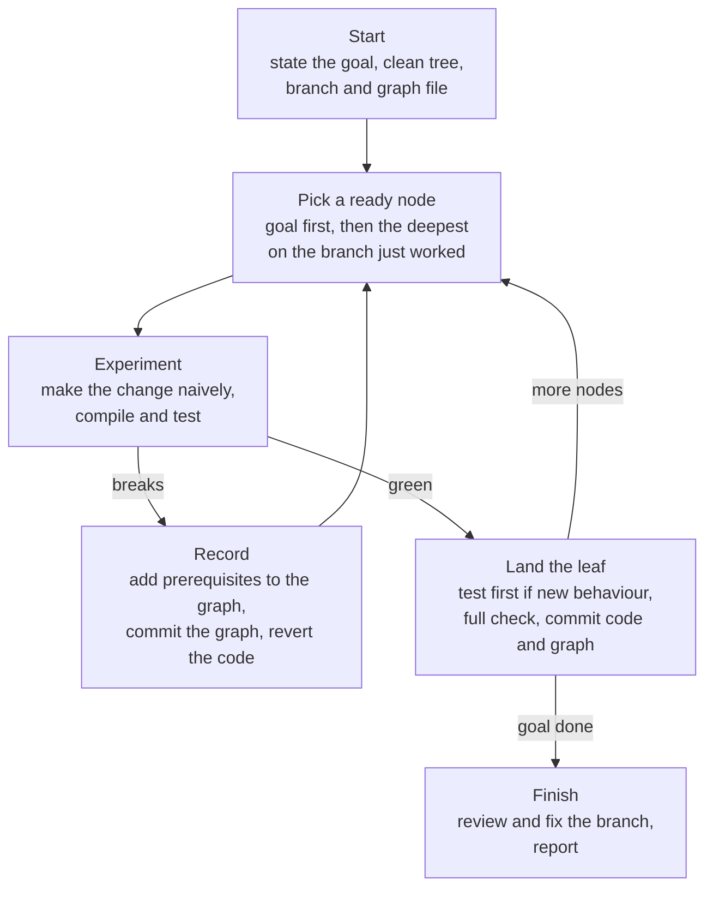
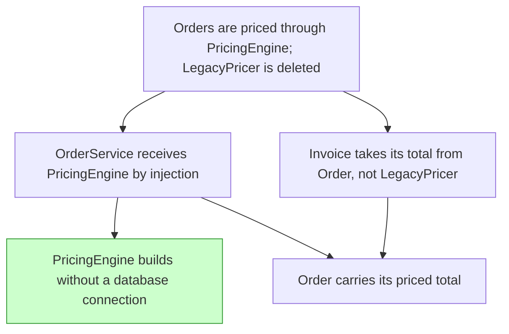

# mikado

Run the Mikado Method (Ola Ellnestam and Daniel Brolund) with an agent on a
structural change whose dependencies you can't map up front. The agent tries the
goal the naive way, writes each break into a graph of prerequisites, reverts,
and then lands the change leaf-first, one green commit per leaf.

The habit it replaces is **fixing forward**: chasing compile errors and test
failures until the build goes green, ending with one snowballed diff that nobody
can review. In a Mikado experiment a break is information. It goes into the
graph, and the code is reverted.

## When to invoke

- "Use Mikado for this." / "Resume the Mikado graph for X."
- A change in progress has snowballed, and each fix reveals more breaks.
- A structural change crosses module or system boundaries through a dependency
  tangle you can't see in advance: carving out a module, swapping a framework,
  or a major platform upgrade.

For a change inside one module, however many call sites it touches, use your
usual development workflow instead.

## How a run goes



- **Start.** The goal is one observable outcome, such as "Orders are priced
  through `PricingEngine`; `LegacyPricer` is deleted". The working tree must be
  clean, because every revert resets to `HEAD`. If you already have a snowballed
  attempt at the goal, it becomes the first experiment: the agent records what
  broke, stashes the attempt so you can recover it, and seeds the graph from it.
  The agent then creates a `mikado/<slug>` branch and commits the graph file.
- **Experiment.** The agent picks a ready node (not done, with every
  prerequisite done) and makes that change directly. For each break it asks:
  could this be changed first, on its own, leaving the build green? If so, it is
  a prerequisite. If not, it belongs to this node and is fixed within the
  experiment.
- **Record and revert.** Each prerequisite becomes a node under the one tried,
  phrased as a state that must hold ("`OrderService` receives `PaymentClient` by
  injection"), not as a symptom ("fix error at OrderService.ts:42"). A log line
  says what broke and where. Only the graph is committed; the experiment is
  thrown away.
- **Land the leaf.** A node that adds behaviour gets a test, written first. The
  agent runs the full check, marks the node done, and commits the code and the
  graph together.
- **Finish.** Once the goal node is done, the agent reviews the whole branch,
  fixes what the review finds, and reports the final graph, the commits, the
  verification run, any decisions it settled, and any stash it made.

## When it stops to ask

The agent drives the experiments, but two things stop it and send you the
graph:

- **A design decision.** A node has materially different options, such as the
  name of a new concept, the shape of an interface, or how a dependency is
  passed. If you pre-authorised the work ("land this", "don't wait for me"), the
  agent takes the smallest reversible option instead, logs it as a decision, and
  lists it in the report.
- **Scope.** The graph outgrows the goal: prerequisites reach another service,
  a schema, or a contract consumed outside the repo, or the graph grows well
  past what the goal seemed to need. This stops the agent even when the work is
  pre-authorised, because it changes what you agreed to. Every commit so far is
  green, so stopping is safe.

## The graph file

The graph lives in `docs/mikado/<slug>.md` on the branch. It holds a Mermaid
graph, with edges running from a node to its prerequisites and done nodes
styled, plus a log that records why each node exists. A mid-run graph looks
like this:



Because the graph is committed, a run can span sessions. Ask the agent to resume
the Mikado graph and it switches to the branch, reads the graph and the log, and
carries on.

Starting the skill authorises commits on the `mikado/` branch. It never pushes.
The graph file is still on the branch when the run finishes, so drop it before
merging if you don't want it in the history.

## Depends on

No other skills. The agent applies your usual development standard to each leaf
and your usual code review at Finish, whichever skills provide them.

## Install

Via [skills.sh](https://skills.sh) from the repo root:

```sh
npx skills@latest add channingwalton/skills
```

Or manually:

```sh
mkdir -p ~/.codex/skills
cp -R skills/mikado ~/.codex/skills/
```

If you don't use Codex, copy it to your agent's skill directory instead.

See [`SKILL.md`](./SKILL.md) for the full instructions the agent follows.
