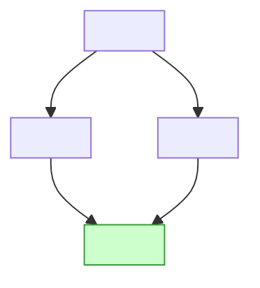

# Mikado

You know the method (Ellnestam and Brolund). This skill fixes how you run it here: you drive the experiments, the graph is a committed file, and every leaf is a commit on a dedicated branch.

The habit to replace is **fixing forward**: chasing breaks until the build goes green, ending with one snowballed diff. In an experiment a break is information. Write it into the graph, then revert.

The graph is the plan, and leaf commits are pre-authorised: this replaces any separate planning step or per-commit approval in your usual development workflow. That workflow's development standard still applies to every leaf, and its code review runs once, at Finish.

## Start

1. **State the goal** as one observable outcome, e.g. "Orders are priced through `PricingEngine`; `LegacyPricer` is deleted". Derive a short slug from it.
2. **Clear the tree**: `git status --porcelain` must be empty, because every revert resets to `HEAD`.
   - **A snowballed attempt at this goal** is the first experiment. Build it and run the tests to capture what broke, then put it away recoverably with `git stash push -u -m "mikado: <slug> first attempt"` and carry on. Its breaks seed the graph in step 3, the log names the stash, and so does the final report.
   - **Uncommitted work unrelated to the goal**: stop and ask.
3. **Branch and graph**: `git switch -c mikado/<slug>`, create `docs/mikado/<slug>.md` from the template below, holding the goal node (plus any prerequisites a stashed attempt revealed), and commit it as `mikado: start <slug>`.

Starting this skill authorises commits on the `mikado/` branch. It does not authorise pushes.

**Resuming:** if `docs/mikado/<slug>.md` already exists, switch to its branch, read the graph and log, check the tree is clean, and continue at the loop.

## The loop

Pick a **ready node**: one that isn't done and whose prerequisites are all done. The first is the goal. After that, prefer the deepest ready node on the branch of the graph you just worked, while its context is fresh.

**Experiment.** Make that node's change directly, the naive way. Build, then run the tests (a targeted subset when the full suite is slow).

Inside an experiment, finish the node's own follow-through: a rename includes its call sites. For each break, ask: *could this be changed first, on its own, leaving the build green?* If yes, it is a **prerequisite**. If no, it belongs to this node; fix it within the experiment. When follow-through starts reaching outside the node, it is snowballing. Stop and record.

**Green: complete the leaf.**

1. If the node adds behaviour rather than reshaping code, it gets a test, written first.
2. Run the project's canonical verification command.
3. Mark the node `:::done`, add a log line, and commit code and graph together as `mikado: <node label>`.

**Red: record, then revert.**

1. Add each prerequisite as a node under the one you tried. Phrase it as the state that must hold ("`OrderService` receives `PaymentClient` by injection"), not as the symptom ("fix error at OrderService.ts:42"). If an existing node already says it, link to that node instead, because the graph is a DAG.
2. Add a log line: the node tried, what broke (file:line and the error, briefly), and the nodes added.
3. Commit **only the graph**: `git commit -m "mikado: <node> needs <n…>" -- docs/mikado/<slug>.md`. The experiment stays uncommitted.
4. Revert: `git reset --hard HEAD && git clean -fd`, then confirm `git status --porcelain` is empty. If the experiment changed dependencies, reinstall so the next run sees the committed set.

Repeat until the goal node is done.

## Checkpoints

You drive, but two things stop you and send the user the graph:

- **A design decision**: a node with materially different options, such as naming a new concept, the shape of an interface, or how a dependency is passed. Present the options as they bear on the graph. If the user has **pre-authorised** the work (asked you to land or finish the change, or told you not to wait), settle it yourself instead: take the smallest reversible option, log it as a `decision` line, and list it in the report.
- **Scope**: the graph outgrows the goal, with prerequisites reaching another service, a schema, a contract consumed outside the repo, or growing well past what the goal seemed to need. This stops you even when the work is pre-authorised, because it changes what the user agreed to. Offer to continue, re-scope the goal, or stop. Every commit so far is green, so stopping is safe.

## Finish

1. Review the whole branch (`<base>...HEAD`) and fix what the review finds. Commit the fixes as ordinary commits, not as graph nodes.
2. Report the final graph (the Mermaid block), the commits, the verification run, any decisions you settled, and any stash you made. Mention that `docs/mikado/<slug>.md` is still on the branch in case the user wants it dropped before merging.

## Graph file

The Mermaid block holds the structure and status. The log is the evidence trail: why each node exists. Edges run from a node to its prerequisites. Node IDs are stable once assigned.

````markdown
# Mikado: <goal>

Branch: `mikado/<slug>`



## Log

- goal tried: `PricingEngine` not constructible in `OrderService` (OrderService.ts:42); `LegacyPricer` used by `Invoice` (Invoice.ts:17) → n1, n2
- n1 tried: … → n3
- decision (n3): `PaymentClient` passed as the first constructor parameter; alternative was a factory
- n3 done
````

## Notation

When writing notes or communicating with the user do not use the node id since its not user-visible, use the name of the node.
