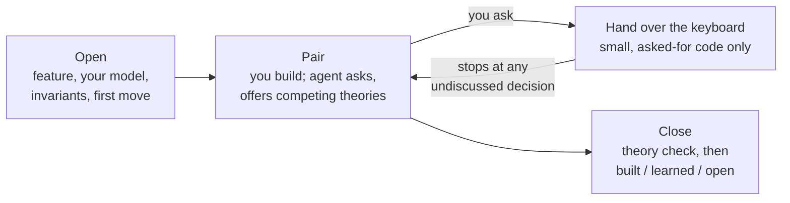

# pair-programming

Pair with an agent on a change you build yourself. The agent discusses the
feature, the candidate solutions, and the code changes with you, but you own the
design and do the building.

This is the reverse of [`software-development`](../software-development/SKILL.md),
where the agent does the implementation. Here the agent acts as a good human
pair would: it reads the problem a second time, remembers what was decided,
watches the invariants, and asks a question at the right moment. It doesn't take
over.

## What it protects

Peter Naur's "Programming as Theory Building" argues that a program is not its
text. It is the theory held by the people who built it: how the code maps to the
world, why it has its present shape, and what it should do next.

The session succeeds only if, at the end, you can:

- explain how the code works;
- say why the important boundaries fall where they do;
- name the invariants and what would violate them;
- predict how the system responds to a related change you haven't made yet.

Shipping good code you can't reason about counts as a failure.

## How a session runs



- **Open.** You describe the feature in domain terms, how you think the code
  works today, what would make the change wrong, and what you'll write first.
  The agent asks only for what's missing.
- **Pair.** The agent keeps you upstream of the design. It asks for your
  prediction before it reveals what it found, asks one question at a time, and
  presents alternatives as competing theories rather than its own preferences.
  It doesn't praise you for agreeing with it. When a mistake costs only a few
  lines, it lets you make it; when the cost would compound, it speaks up at once.
- **Hand over the keyboard.** When you ask for boilerplate, a fixture, or a
  mechanical change, the agent writes only that, small enough to read in one
  pass. It states its assumptions next to the code they affect and leaves out
  unrelated cleanup. If writing the code turns up a decision you haven't
  discussed, such as a new name, an error case, or a boundary, it stops and asks
  you.
- **Close.** The agent asks you to reason about something you haven't built
  yet, unless the session has already shown you can. It then summarises the
  session in three separate parts: what was **built** and how it was verified,
  what was **learned**, and what is still **open**.

## When to invoke

- "Let's pair on this."
- "I'm going to build X. Pair with me."
- You want help thinking through a change but plan to write it yourself.

If you want the agent to do the implementation, use `software-development`
instead.

## Install

Via [skills.sh](https://skills.sh) from the repo root:

```sh
npx skills@latest add channingwalton/skills
```

Or manually:

```sh
mkdir -p ~/.codex/skills
cp -R skills/pair-programming ~/.codex/skills/
```

If you don't use Codex, copy it to your agent's skill directory instead.

See [`SKILL.md`](./SKILL.md) for the full instructions the agent follows.
